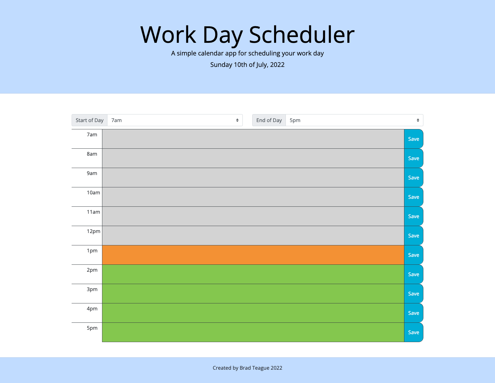

# Work Day Scheduler Starter Code

This application allows the user to store items in an hourly calendar.

The display on the calendar provides visual feedback on which items are current.

The user may also adjust the standard hours of their work day.

Data is stored in local storage for persistant memory.

[Github Repo](https://github.com/bradbrad88/scheduler)

[Deployed Site](https://bradbrad88.github.io/scheduler)

